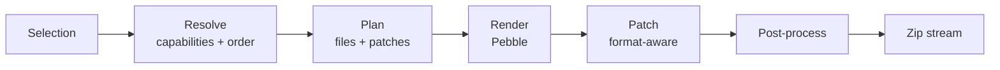

# Project Bootstrapper — Unified Plan

2026-09-19 · supersedes *Build Plan* and *Implementation Plan & LLM Prompt*

> Working name: **Kitbash** — kitbashing is building a model by combining parts from several kits, which is exactly the thesis of this document.

## 1. What we're building

A self-hosted web app where a developer picks a backend, a frontend or mobile target, an architecture, a build tool and a set of features, clicks **Generate**, and gets a zip holding a project that compiles, runs and passes its own tests on the first try. Any configuration can be saved as a **preset** and re-run in one click; every generation is recorded so an old one can be reproduced byte-for-byte.

Spring Initializr, but covering both halves of a product, with combinations composed at request time rather than hand-maintained one by one.

Happy path:

1. The wizard fetches the option catalog from the server. The UI hardcodes nothing about what exists.
2. The user picks options. Incompatible choices grey out live; conflicts surface before Generate, not after.
3. Optional: preview the file tree and any single file's contents.
4. Generate — the server resolves the selection into a file plan, renders it, streams a zip.
5. Unzip, run one command, it works.

**Non-goals for v1.** No multi-tenant SaaS (one team behind SSO). No provisioning of real infrastructure — it emits compose and CI files, it does not apply them. No code generation from a domain model or DB schema; that is a different product. No in-browser editing of generated code. No user-uploaded recipes (own threat model, §13).

## 2. Where the two source plans disagree, and what this one does

Both prior plans agree on the product. They disagree on the machinery, and every disagreement below is decided here rather than left open.

| Question | Build Plan | Implementation Plan | Decision here |
| --- | --- | --- | --- |
| Unit of composition | Composable recipes resolved per request | A `ProjectGenerator` Java class + template tree per technology | **Recipes (data) by default, plus a narrow typed hook SPI** for the few transforms data cannot express — §4 |
| Server language | Kotlin 2.x / JDK 21 | Java 21 | **Java 21.** Decided by who maintains it: the team is Java-only. Java 21 carries records, sealed interfaces and pattern-matching `switch`, so the domain modelling argument for Kotlin survives the switch almost intact |
| Bootstrapper build tool | Gradle Kotlin DSL | Maven | **Gradle, Kotlin DSL.** Same tool and dialect the generated JVM projects default to — maintainers should be fluent in the build files the catalog emits. The one place Kotlin remains, and it is build scripts, not application code |
| Template engine | Pebble | Thymeleaf "or appropriate" | **Pebble.** Thymeleaf is an HTML templating engine; the output here is source code |
| Workspace | In-memory `Map<String, ByteArray>` | `/tmp/bootstrapper/{id}/` then cleanup | **In-memory.** Projects are a few hundred KB; this deletes a whole class of temp-dir and cleanup bugs |
| Sync or async | Sync, streamed; 202 kept as an escape hatch | Async job with PENDING→COMPLETED states | **Both, split by job kind:** generation is sync and streamed (tens of ms); *build validation* is an opt-in async job (§12) |
| Naming | Recipe vs preset | "Template" for everything | **Three nouns, enforced:** Recipe / Preset / Generation (§3) |
| Wizard shape | One page, grouped options | 10-step wizard | **One page** with grouped sections and a live right-rail summary. Steps add friction at this option count |
| Version policy | Presets default to track-latest | Templates never auto-upgrade | **Presets track latest; every *generation* stores a lock** so any past build is exactly reproducible (§7) |
| Catalog scope v1 | 2 backends, narrow, fully verified | Broad list incl. Keycloak, Kafka, Flutter, Vue | **Narrow (§11).** Breadth is cheap once the engine is right and ruinous before |
| Architecture options | Layered, Hexagonal, Modular monolith | + Clean, + "REST API" | **Three.** Clean and Hexagonal produce near-identical trees; "REST API" is not an architecture |

Everything else is additive: the recipe engine, capability model, patch operations, determinism and verification matrix come from the Build Plan; generation history, the versioned configuration envelope, the structured error model, the async job abstraction, the catalog metadata surface and the definition-of-done checklist come from the Implementation Plan.

## 3. Three nouns, never confused

Both prior documents call different things "template", and that ambiguity would make the codebase incoherent within a month.

| Noun | Owned by | Stored in | Lifecycle |
| --- | --- | --- | --- |
| **Recipe** | Maintainers | Git, under `/recipes` | Versioned, reviewed, shipped with the app |
| **Preset** | A user or team | Postgres | Saved selection; the "save as template" feature |
| **Generation** | The system | Postgres + object store | An immutable record of one render, with its lock and its zip |

Recipes are the building blocks. Presets are configurations of them. Generations are the receipts.

## 4. The engine: recipes, with a hook escape hatch

The single decision that determines whether this project survives: **never store a template per stack combination.** With 2 backends × 3 architectures × 2 build tools × 2 frontend states × 2 auth × 2 CI you get ~96 reachable combinations; adding one backend multiplies it again. Whole-stack templates mean every Spring Boot bump touches every directory. That failure mode kills scaffolding projects.

The Implementation Plan's answer — one `ProjectGenerator` implementation per technology — avoids the combinatorial template tree but recreates the problem in code: cross-cutting concerns (auth touches the backend *and* the router *and* compose *and* the CI file) end up as coordination between generator classes, which is `if/else` wearing an interface.

So: **each selectable thing is a recipe** — a folder of Pebble templates plus a `recipe.yaml` manifest declaring what it provides and requires. A resolver assembles the chosen set into one file plan.



**The hook SPI.** A handful of things are genuinely awkward as data: computing a Gradle version catalog from the union of selected recipes, emitting a lockfile, deriving a compose service graph. Rather than bending the manifest format, a recipe may declare one hook:

```java
public interface RecipeHook {
    String recipeId();
    List<PatchOp> contribute(PlanContext ctx);   // pure; no I/O, no shell
}
```

Hooks run in the plan stage, return patch ops like everything else, and are registered in `core` — not loaded from the recipe directory. Keep this list short; if more than ~3 recipes need a hook, the manifest format is missing a feature and should gain one instead.

### Recipe format

A directory: `recipe.yaml` plus a `files/` tree. Paths inside `files/` are themselves templated, so `files/src/main/java/{{ packagePath }}/Application.java.peb` lands in the right package.

```yaml
id: backend-spring-boot-java
version: 1.4.0                 # recipe semver, independent of the framework version
frameworkVersion: "3.4.1"      # what it emits, surfaced in the UI
kind: backend                  # base | backend | frontend | mobile | feature | infra | ci
label: Spring Boot (Java)

provides: [http-server, rest-api, openapi-spec, jvm-project]
requires: [build-tool, database]
conflictsWith: [backend-spring-boot-kotlin]

options:
  - id: architecture
    type: enum
    values: [layered, hexagonal, modular-monolith]
    default: hexagonal
    help: Determines the package layout and dependency direction.

variables:
  required: [groupId, artifactId, packageName, javaVersion]

files:
  - from: files/**
    when: always
  - from: arch/hexagonal/**
    when: "architecture == 'hexagonal'"

patches:
  - target: .gitignore
    op: appendLines
    lines: [build/, .gradle/]
```

**Capabilities are the glue.** The React recipe says `requires: [rest-api]`, and `requires: [openapi-spec]` when the typed-client option is on. The resolver validates the selected set structurally, instead of against a hand-written matrix of exceptions — which is what the Implementation Plan's compatibility table would have become.

**Patch operations are what make composition real.** Several recipes need to modify the same file; free-text appending produces broken syntax within a week. Patches are typed and format-aware:

| Operation | Applies to | What it does |
| --- | --- | --- |
| `addDependency` | build.gradle.kts, pom.xml, package.json | Inserts into the right block, dedupes, respects the version catalog |
| `mergeYaml` | application.yml, compose.yaml, CI files | Deep merge, fails on scalar collision |
| `mergeJson` | package.json, tsconfig.json | Deep merge, arrays union |
| `addScript` | package.json | Adds an npm script, fails loudly on name collision |
| `insertAtMarker` | any text file | Inserts at `// kitbash:imports` markers placed by the owning recipe |
| `appendLines` | .gitignore, .env.example | Idempotent line append |
| `addEnvVar` | .env.example, compose.yaml | Adds the variable in both places at once |
| `addComposeService` | compose.yaml | Service + healthcheck + `depends_on` wiring |

Every patch is idempotent and names the recipe owning its target. A patch against a file no selected recipe produced fails at validate time with a clear message, never silently.

**Ordering and determinism.** Topological sort by dependency: base → backend → frontend → features → infra → CI; ties broken by recipe id. Two identical selections must produce byte-identical zips — the cache key and the reproducibility guarantee both depend on it. Fixed zip timestamps, sorted entries, normalized line endings.

### Reference projects are the source of truth

Recipe content is not written from scratch. Each recipe derives from a **reference project** under `/reference` that actually compiles, with placeholders introduced only for names, coordinates and versions. Editing a real project beats editing template soup.

This is enforced, not just recommended: a CI test renders each recipe with the reference variable set and asserts the output equals the checked-in reference project byte-for-byte. Drift between "the thing we maintain" and "the thing we emit" becomes a failing test rather than a user's broken build.

## 5. Stack for the bootstrapper itself

| Layer | Choice | Why |
| --- | --- | --- |
| Server language | **Java 21** | Records and sealed interfaces model Recipe, FilePlan and PatchOp cleanly; pattern-matching `switch` over a sealed `PatchOp` gives exhaustiveness where the appliers dispatch; virtual threads suit fan-out across files |
| Framework | Spring Boot 3.x, Spring MVC (not WebFlux) | Generation is CPU work, not I/O fan-out; MVC on virtual threads streams zips fine |
| Build | Gradle 8.x, Kotlin DSL, version catalog | Multi-module with a dependency-free `core`; same tool and dialect the output defaults to |
| Templating | Pebble | Jinja2-like conditionals and loops, JVM-native, sandboxable. Logic-less engines fight you when the output is code |
| Web | React 19 + TypeScript + Vite + pnpm | Fast dev loop |
| UI | Tailwind + shadcn/ui | Mostly forms and disclosure |
| Client state | TanStack Query (catalog) + Zustand (selection) | Cached server data vs local ephemeral state |
| Forms | React Hook Form + Zod, schema built at runtime from catalog metadata | Form shape follows the catalog, so it cannot be a static schema |
| DB | Postgres 16 + Flyway | Selections are jsonb with a few indexed columns |
| Object store | S3-compatible (MinIO locally) | Content-addressed zips |
| Server tests | JUnit 5 + AssertJ + Testcontainers | Resolver tests are parameterized over catalog combinations, so plain JUnit parameterization carries most of the suite |
| Web tests | Vitest + Playwright | Playwright covers wizard → download |

**No Lombok in `core`.** Records cover the data carriers, and Lombok's generated members fight the sealed `PatchOp` hierarchy and the pattern-matching switches built on it. If Lombok earns its place anywhere it is in `api` entities, and even there prefer records for DTOs.

A JVM server emitting Go, Python or TypeScript projects is not a contradiction: the server never compiles the output, it renders text and writes a tree. Compilation is the verification matrix's job and runs in per-ecosystem containers.

## 6. Modules and pipeline

Gradle multi-module, domain free of Spring so the generator is drivable from tests and the CLI without booting a context.

| Module | Depends on | Contents |
| --- | --- | --- |
| `core` | stdlib only | Selection, Recipe, Capability, FilePlan, PatchOp, hooks; resolver; patch appliers; zip writer |
| `catalog` | `core` | Loads and validates recipes at boot; builds the metadata document; computes catalog digest |
| `render` | `core` | Pebble config, sandboxing, path templating |
| `api` | above + Spring Boot | Controllers, presets, history, cache, auth, rate limits |
| `verify` | `core`, `catalog`, `render` | Matrix runner and the on-demand build-validation job |
| `cli` | `core`, `catalog`, `render` | Offline generation, no server |

Stages, built as separate testable functions rather than one method:

1. **Parse** — selection JSON → typed `Selection`. Unknown recipe ids rejected here.
2. **Resolve** — expand implied recipes, check `requires`/`conflictsWith`, topologically sort. Pure function, no I/O. Most unit tests live here.
3. **Plan** — walk recipes in order, evaluate `when`, run hooks, collect file entries and patch ops. Still no rendering. Enforce file-count and size caps here.
4. **Render** — render paths and bodies through Pebble. Parallelizable across files.
5. **Patch** — apply ops in recipe order; appliers parse, merge, re-serialize.
6. **Post-process** — git skeleton with one initial commit, file modes (`gradlew` = 0755), line endings, entry sort.
7. **Package** — stream to `ZipOutputStream` with fixed timestamps.

`/preview` runs 1–5. `/validate` runs 1–2, which is what makes live conflict-checking cheap enough to call on every option change.

## 7. Versioning: the piece both plans got half right

Four versioned things, each with a defined role:

| Thing | Format | Role |
| --- | --- | --- |
| Schema version | integer on the selection envelope | Lets the selection JSON evolve; migrations are code in `core` |
| Recipe version | semver per recipe | What a pin references (`backend-spring-boot-java@1.4.0`) |
| Catalog digest | sha256 over the recipe set | Identifies "which catalog rendered this"; part of the cache key |
| Framework version | whatever upstream uses | Displayed to users; bumped by the weekly freshness job |

**The reconciliation.** The Build Plan defaults presets to track-latest so a team's house standard follows framework upgrades; the Implementation Plan insists a saved template must never silently change. Both are right about different objects:

- **Presets track latest by default.** The common case is "give me our standard service again", and a preset frozen on Spring Boot 3.2 is a trap. Pinning remains available per preset for compliance cases.
- **Generations carry a lock.** Every generation records the exact resolved recipe versions and catalog digest. From history you can *Regenerate exactly* (replay the lock) or *Regenerate current* (re-resolve today).

That gives reproducibility without staleness, which neither plan achieved alone. It also makes "this used to work" debuggable: diff two generation locks.

Selection envelope:

```json
{
  "schemaVersion": 1,
  "projectName": "customer-management",
  "options": {
    "backend": "backend-spring-boot-java",
    "architecture": "hexagonal",
    "buildTool": "gradle-kts",
    "frontend": "frontend-react-vite",
    "database": "db-postgres-flyway",
    "auth": "auth-jwt",
    "ci": "ci-gitlab",
    "docker": true
  },
  "variables": { "groupId": "com.example", "packageName": "com.example.customer", "javaVersion": "21" }
}
```

Flat and keyed by option id, not nested by category — the nested shape in the Implementation Plan bakes the category taxonomy into every client, and a new category becomes a breaking change. Canonicalization (sorted keys, defaults elided) produces the hash used for caching and dedupe.

## 8. HTTP API

| Method | Path | Purpose |
| --- | --- | --- |
| GET | `/api/v1/metadata` | Whole catalog: recipes, options, defaults, constraints, versions, verification status. ETag-cached, immutable per catalog digest |
| POST | `/api/v1/validate` | Resolve only; returns conflicts, warnings, effective option set. Called on every wizard change, debounced |
| POST | `/api/v1/preview` | File tree with sizes; `?path=` returns one file's contents |
| POST | `/api/v1/generate` | Streams `application/zip`, records a generation |
| GET | `/api/v1/generations` | History for the caller |
| GET | `/api/v1/generations/{id}` | Record incl. lock and selection |
| GET | `/api/v1/generations/{id}/download` | Re-download from the object store while retained |
| POST | `/api/v1/generations/{id}/replay` | Regenerate from the lock (exact) or current catalog |
| POST | `/api/v1/verify` | Opt-in async build validation, open to every authenticated user; returns 202 + job id, or 200 with an existing run when that selection was already verified against this catalog digest |
| GET | `/api/v1/verify/{id}` | `PENDING \| RUNNING \| PASSED \| FAILED` + logs |
| POST / GET | `/api/v1/share`, `/api/v1/share/{token}` | Short token ↔ selection |
| GET POST | `/api/v1/presets` | List, create |
| GET PUT DELETE | `/api/v1/presets/{id}` | Read, update, remove |
| POST | `/api/v1/presets/{id}/generate` | One-click regeneration |
| GET | `/api/v1/health`, `/api/v1/info` | Actuator; `info` exposes catalog digest and recipe count |

The metadata endpoint is the hinge. It carries option groups, types, dependency rules, labels, help text and per-combination verification badges. The wizard renders itself from that document, so adding a recipe is a backend-only change. Resist every temptation to hardcode an option name in React.

Selections also serialize into query parameters so a configured wizard has a copyable URL; short tokens exist for when that gets unwieldy, but the URL form stays the default because it survives without server state.

Generation is synchronous and streamed — rendering takes tens of milliseconds and a queue would be complexity with no payoff. The 202 pattern exists exactly once, for build validation, which genuinely takes minutes.

## 9. Web app

Metadata-driven forms, not hand-written ones. The React code contains zero knowledge of what a Spring Boot or an Expo project is.

```
web/src/
  catalog/      # fetch + typed access to metadata (TanStack Query)
  wizard/
    fields/     # one component per option type: enum, boolean, string, multi-select
    FieldRenderer.tsx   # option type -> component; the only switch in the app
    useSelection.ts     # Zustand store + URL sync
    useValidation.ts    # debounced POST /validate
  preview/      # file tree + syntax-highlighted file pane
  presets/      # list, save dialog, detail
  history/      # generations, download, replay, "save as preset"
  lib/          # api client generated from the server's OpenAPI spec
```

Pages: **Configure** (the one-page wizard), **Presets**, **History**, **Catalog** (browse recipes and versions, read-only), **Settings**. The Implementation Plan's Dashboard is folded into Presets — a counter tile page earns nothing; the preset list is what a returning user actually wants, one click from a cold load.

Layout: left column of option groups, right rail with the live resolved stack summary, persistent bottom bar with Preview / Save as preset / Generate.

Interaction details that matter more than they sound:

- Validation debounced 250 ms; conflicts render inline on the offending field, never as a top banner.
- Options blocked by a conflict stay **visible and disabled** with the reason on hover. Hiding them makes the catalog feel arbitrary.
- Selection syncs to the URL on every change: back/forward work, links capture a configuration.
- Preview loads the tree lazily; clicking a file fetches just that file.
- Generate downloads via an anchor or form post, not `fetch`+blob, so the browser shows native download progress.
- Combinations the nightly matrix reports red get a warning badge at the option pairing.
- Dark mode, keyboard navigation across groups, catalog digest in the footer — that footer is what makes a bug report actionable.

## 10. Data model

```sql
create table preset (
  id             uuid primary key,
  owner_id       uuid not null,
  name           text not null,
  description    text,
  visibility     text not null,            -- private | team | public
  selection      jsonb not null,
  version_policy text not null,            -- track_latest | pinned
  pinned_recipes jsonb,                    -- recipe id -> version, null when tracking
  revision       int not null default 1,
  created_at     timestamptz not null,
  updated_at     timestamptz not null,
  unique (owner_id, name, revision)
);

create table generation (
  id              uuid primary key,
  owner_id        uuid,
  preset_id       uuid references preset(id) on delete set null,
  project_name    text not null,            -- shown in history; deleted with the record
  selection       jsonb not null,
  lock            jsonb not null,           -- recipe id -> exact version
  catalog_digest  text not null,
  selection_hash  text not null,
  artifact_key    text,                     -- object store key, null once expired
  status          text not null,
  duration_ms     int,
  size_bytes      int,
  created_at      timestamptz not null,
  expires_at      timestamptz,              -- created_at + 30d; null when kept
  kept            boolean not null default false
);
create index on generation (owner_id, created_at desc);
create index on generation (selection_hash);

create table share_link (
  token      text primary key,
  selection  jsonb not null,
  created_at timestamptz not null,
  expires_at timestamptz
);

create table verification_run (
  id              uuid primary key,
  requested_by    uuid,                        -- null for matrix runs
  selection       jsonb not null,
  lock            jsonb not null,
  selection_hash  text not null,
  catalog_digest  text not null,
  status          text not null,               -- pending | running | passed | failed
  log_key         text,
  started_at      timestamptz,
  finished_at     timestamptz,
  expires_at      timestamptz
);
create unique index on verification_run (selection_hash, catalog_digest)
  where status in ('pending','running','passed');
```

**The recipe catalog is not in the database.** Recipes live in the repo, are validated at boot and held in memory — reviewable, diffable, versioned with the code that renders them. The Implementation Plan's `Technology` / `TechnologyVersion` / `Architecture` tables would put the catalog behind a migration and an admin CRUD screen for no gain; a DB-backed catalog is only needed for user-uploaded recipes, which is a phase 5 question with real security weight.

**Zip cache.** Key on `sha256(catalogDigest + canonicalSelection)`; S3-compatible storage with a 30-day lifecycle; bounded in-memory LRU for key→object mapping. Deterministic rendering makes a cache hit safe to serve verbatim. Popular `selection_hash` values tell you which stacks to prioritize in the matrix.

**Retention: 30 days, uniformly.** Cached zips expire by S3 lifecycle rule, generation rows and verification logs by a nightly sweep on `expires_at`. One number across all three keeps the story explainable — "anything older than a month is gone unless you kept it" — instead of three policies nobody can recall.

Nothing reproducible is lost at expiry, because the lock is the valuable part and it is small. A **Keep** action on a history row sets `kept` and clears `expires_at`, exempting both the record and its zip; saving a generation as a preset copies its lock forward regardless. Expiring the artifact while keeping the row is also allowed and is what the sweep does to a kept row's zip after a year — the row still replays, it just re-renders.

History keeps the project name, since users need to recognize their own rows, and deletes it with the record. Logs and metrics carry hashes and recipe ids only — never package or project names.

## 11. Catalog scope for v1

Ship a narrow catalog that works completely rather than a broad one that half-works.

| Slot | v1 | Deferred |
| --- | --- | --- |
| Backend | Java + Spring Boot (phase 0); Kotlin + Spring Boot (phase 3) | NestJS, FastAPI, Go + Echo, Quarkus |
| Build tool | Gradle Kotlin DSL; Maven | Bazel, Mill |
| Architecture | Layered; Hexagonal; Modular monolith | Event-driven, CQRS |
| Frontend | React + TypeScript + Vite (SPA) | Next.js, Angular, Vue, SvelteKit |
| Mobile | none | React Native + Expo, then Compose Multiplatform |
| Database | Postgres + Flyway, JPA or jOOQ | MySQL, MongoDB, Liquibase, Exposed |
| Auth | None; JWT resource server | Keycloak/OIDC, session-based |
| Messaging | none | Kafka, RabbitMQ, Redis |
| API contract | springdoc OpenAPI + generated TS client | GraphQL, gRPC |
| Observability | Actuator + Micrometer; optional OpenTelemetry | Full LGTM compose stack |
| Containers | Dockerfile + compose.yaml | Helm, Terraform |
| CI | GitLab CI; GitHub Actions | Jenkins, Drone |

Roughly 96 reachable combinations — a sane matrix to verify and real proof the composition model works.

**Architecture must not be cosmetic.** Layered gives `controller/`, `service/`, `repository/`. Hexagonal gives `domain/`, `application/port/`, `adapter/in/web/`, `adapter/out/persistence/` with a framework-annotation-free domain. Modular monolith gives per-feature packages with internal layering and an explicit public API class per module. If an architecture option only renames folders, drop it — a misleading option is worse than a missing one. This is why Clean is not in v1: as usually implemented it emits the same tree as Hexagonal.

Keycloak and Kafka move out of the MVP deliberately. Both add a container, a healthcheck, a startup race and a whole verification dimension; JWT resource-server auth proves the auth recipe shape at a fraction of the cost.

## 12. Verification: one runner, three triggers

The highest-value infrastructure in the project. It exists from phase 1, not retrofitted. The Build Plan's nightly matrix and the Implementation Plan's per-generation build validation are the same machine with different inputs, so build it once:

| Trigger | Input | Cadence |
| --- | --- | --- |
| Merge request | ~8 representative cells | Every MR, under 10 min |
| Nightly | Every enumerated combination **plus the top 20 `selection_hash` values from real history** | Nightly, under 20 min warm; shard by ecosystem if it creeps |
| On demand | One user's selection, from the UI's "Verify this build" — available to **every authenticated user**, not just maintainers | 202 + poll; deduped against an existing run for the same selection and catalog digest |

Each cell calls the generator through `cli` (no server), unzips into a workspace, and runs that stack's real build and test commands in an ecosystem container — `./gradlew build`, `pnpm build && pnpm test`. Not a snapshot test of rendered text. Failures report the exact selection JSON so reproducing locally is one command. Results publish to a status page and feed the wizard's badges.

Feeding real history into the nightly run is the piece neither plan had: it guarantees the combinations people actually use are the ones under test, not just the ones someone enumerated.

**Opening `verify` to everyone is affordable because the work is deduplicated, not because it is cheap.** A run is keyed by `(selection_hash, catalog_digest)`, so the second person to verify the house stack gets the first person's result instantly, and the nightly matrix pre-populates every enumerated cell — meaning most user-triggered verifies for common stacks are already green before anyone asks. What is left is the genuinely novel combination, which is exactly the case worth spending a container on. Controls: one concurrent run per user, a global worker pool of four, a 15-minute hard timeout, and a queue-depth cap that returns 429 with the current depth rather than silently queueing for an hour.

**Dependency freshness.** A weekly job bumps framework and library versions in recipe manifests, runs the full matrix, and opens an MR when green. Scaffolding rots by default; this is the only thing that stops it, and it is what makes a six-month-old preset still produce a modern project.

**Never run generated builds on the API host.** Validation runs in disposable containers with no network beyond a dependency proxy, a CPU and memory cap and a hard timeout.

## 13. Security and limits

A generator takes user strings and writes them into files someone will then execute. Treat every input as hostile.

- **Allowlist identifiers.** `groupId`/package against `^[a-z][a-z0-9_]*(\.[a-z][a-z0-9_]*)*$`; artifact and project name against `^[a-z][a-z0-9-]{0,63}$`. Reject Java and Kotlin reserved words in package segments. Reject with a message — never sanitize by stripping, since silent rewriting produces surprising output.
- **Path traversal / zip slip.** Every rendered path is normalized and must resolve inside the project root. Reject `..`, absolute paths, and Windows reserved names (`CON`, `PRN`, …) since zips get extracted there too.
- **Resource caps,** enforced at the plan stage so failures happen before bytes stream: 5,000 files, 50 MB uncompressed total, 5 MB per file, 10 s wall clock.
- **Template sandboxing.** Pebble with unsafe extensions removed: no reflection, no arbitrary method invocation, no `include` from user-controlled paths. The variable map holds validated primitives only, never live service objects.
- **Rate limits** on `/generate` and `/share`, keyed by user then IP; cache hits do not consume budget. `/verify` is open to every authenticated user but throttled by concurrency rather than by request count — one running job per user, four globally, 15-minute timeout, dedupe by selection hash (§12). Verification containers get no network beyond the dependency proxy.
- **Auth.** OIDC against the existing identity provider. Catalog read and generate are open to any authenticated user; preset write and `public` visibility require a role.
- **Dependency provenance.** Pin upstream versions in manifests and run generated dependency trees through a vulnerability scan in the nightly matrix, so this does not become an efficient distributor of known-vulnerable dependencies.
- **No configuration value ever becomes a shell command.**

User-uploaded recipes change the threat model completely — separate process, no network, read-only FS, hard memory/CPU caps, review before a recipe becomes visible. That is its own project, not a checkbox.

## 14. Errors and observability

Generation failures must name the stage, the recipe and the file. Structured envelope, rendered verbatim by the UI:

```json
{
  "error": "PATCH_TARGET_MISSING",
  "stage": "patch",
  "recipe": "feature-auth-jwt",
  "file": "backend/src/main/resources/application.yml",
  "message": "Patch target was not produced by any selected recipe.",
  "hint": "feature-auth-jwt requires capability 'http-server'; select a backend.",
  "selectionHash": "9f2c…"
}
```

Errors are typed enums in `core`, not strings assembled at the controller. Every one carries a hint that names the next action.

Metrics: generation duration and outcome, cache hit rate, recipe usage, validation failure reasons by type, matrix pass rate per cell. Structured JSON logs with a correlation id; no project or package names in logs.

## 15. What "ready to start working on" means

The acceptance bar, written as an executable checklist the matrix asserts — not aspiration. A generated project must:

- **Start with one command.** `docker compose up`, or `./gradlew bootRun` + `pnpm dev` if Docker was declined. The README states that command in the first screen of text.
- Contain a **working vertical slice**: one example entity with a migration, repository, service, REST controller, OpenAPI-documented endpoint, and a frontend page that lists and creates it. An empty skeleton teaches nothing; a working slice is something to edit.
- Have **passing tests out of the box**: one unit test, one Testcontainers integration test against the real database, one frontend component test. `./gradlew test && pnpm test` green is the strongest signal the scaffold is not broken.
- Ship an **initialized git repo** with a correct `.gitignore` for every tool in the stack and one initial commit.
- Ship formatting and linting wired up — ktlint/Spotless, ESLint, Prettier, `.editorconfig` — with a format check in CI.
- Ship a **CI pipeline** for the chosen provider that builds, tests, lints and produces a container image.
- Ship multi-stage, non-root `Dockerfile`s and a `compose.yaml` with a database healthcheck so the app does not race it on startup.
- Ship `.env.example` listing every variable the app reads, and fail fast at startup with a readable message when one is missing.
- Include health endpoints, structured JSON logging and request correlation ids.
- Ship a README describing **only the stack actually selected**. A README mentioning Redis when Redis was not chosen is the tell of a broken generator.

**The typed client is what makes this more than two scaffolds in one zip.** When a backend and frontend are both selected, springdoc exposes the OpenAPI document and a Gradle task runs openapi-generator to emit a TypeScript client into `frontend/src/lib/api`; the generated page consumes it. Change a backend DTO, regenerate, and TypeScript fails at the call site. Without this, a full-stack generator is two unrelated folders in a zip.

## 16. Repo layout

```
/server
  /core /catalog /render /api /verify /cli    # Gradle multi-module
/web                                          # React app
/recipes
  /base /backend-spring-java /backend-spring-kotlin
  /frontend-react-vite /feature-auth-jwt /feature-observability
  /db-postgres-flyway /infra-docker /ci-gitlab /ci-github
/reference                                    # real compiling projects recipes derive from
/verification                                 # matrix runner + per-ecosystem images
/docs
compose.yaml                                  # postgres + minio + server + web for local dev
```

## 17. Phases

Each phase is shippable on its own and has an exit test, not a feeling.

**Phase 0 — walking skeleton.** One hardcoded stack (Java, Spring Boot, Gradle, layered, no frontend) — the reference project the maintaining team reads most often should be in the language they maintain. One endpoint streaming a zip. One React button. No recipe engine.
*Exit:* the downloaded zip unzips and `./gradlew build` passes, executed in CI.

**Phase 1 — recipe engine.** Extract that stack into recipes. Resolver, capability checks, patch operations, metadata endpoint, metadata-driven wizard. Add the React frontend recipe so composition is exercised for real. Stand up the verification matrix, even at four cells, plus the reference-project equality test.
*Exit:* four cells green nightly; adding a recipe requires no frontend change.

**Phase 2 — persistence and product surface.** Postgres, OIDC, presets with visibility, generation history with locks and replay, share links, preview endpoint and file-tree viewer, zip cache.
*Exit:* generate → save preset → cold reload → one-click regenerate produces an identical zip from cache.

**Phase 3 — catalog breadth.** Kotlin backend, Maven, remaining architectures, JWT auth, observability, the OpenAPI typed-client wiring, GitHub Actions. Expand to the full matrix and add the weekly dependency-bump job.
*Exit:* ~96 cells green nightly under 20 minutes; a backend DTO change breaks frontend typecheck in a generated project.

**Phase 4 — validation and polish.** On-demand build validation job, verification badges in the wizard, structured error surface, history-fed nightly runs, CLI binary published.
*Exit:* a user can verify their own combination from the UI and read the build log.

**Phase 5 — extension.** Recipe authoring SDK (manifest schema, local test harness), `npx create-stack` against the same API, React Native, pushing the generated repo straight into a GitLab group instead of downloading a zip, and — only if justified — user-contributed recipes with the sandbox its threat model demands.

Build the resolver test suite in phase 1 and keep it fast and pure. It is the component with real logic and the one where regressions stay invisible until a user's project fails to compile.

## 18. Decisions taken

Every question either document left open is now answered. The last three were settled on 2026-09-19 and are marked below.

| Question | Decision |
| --- | --- |
| Who uses this | An internal team behind existing SSO. Auth lands in phase 2; rate limits stay modest |
| Reference projects or pure templates | Reference projects, with a CI equality test binding them to the recipes |
| Push to GitLab | Phase 5, not v1. The zip path must be excellent first, and the API surface changes when a push target exists |
| Frontend standalone | Yes, supported — `frontend-react-vite` without a backend simply does not select the typed-client capability. It costs one conditional and doubles nothing, because the matrix samples rather than enumerates the frontend-only axis |
| Maven in v1 | Yes, but in phase 3. It doubles every JVM backend's dependency patches, and phase 1 does not need that weight |
| Catalog versioning | Recipes version independently (semver); the catalog carries a derived content digest. Pins reference `recipe@version`; the digest identifies the render |
| **Server language** | **Java 21.** The maintaining team is Java-only, which outranks the marginal modelling win; records, sealed interfaces and pattern-matching `switch` recover most of it. Consequences: no Kotest (JUnit 5 + AssertJ), no Lombok in `core`, and the **Java + Spring Boot backend recipe moves from phase 3 to phase 0** so the reference project is in the maintainers' language. Gradle Kotlin DSL stays for build scripts only |
| **Retention** | **30 days** for cached zips, generation records and verification logs alike, with a per-row **Keep** exemption (§10) |
| **Who can run `verify`** | **Every authenticated user.** It is affordable because runs dedupe by `(selection_hash, catalog_digest)` and the nightly matrix pre-populates the common cells; throttled by concurrency — one per user, four globally, 15-minute timeout (§12) |

## 19. Working principle

Do not build this as a collection of hardcoded branches on technology names. `Recipe`, `Capability`, `PatchOp`, `Selection` and `FilePlan` are independent concepts, and adding a technology should mean adding a recipe directory plus, rarely, one hook — never editing the core generation workflow. Prioritize the engine's correctness over the catalog's size: breadth added to a sound engine is a weekend, breadth added to an unsound one is the reason these projects die.
